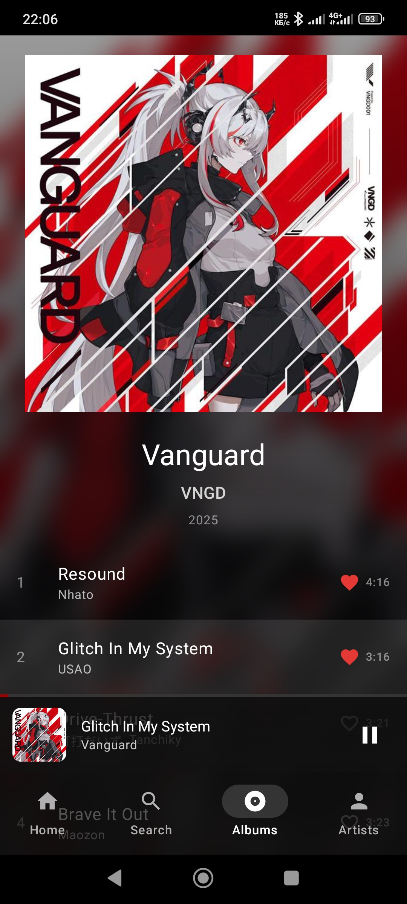
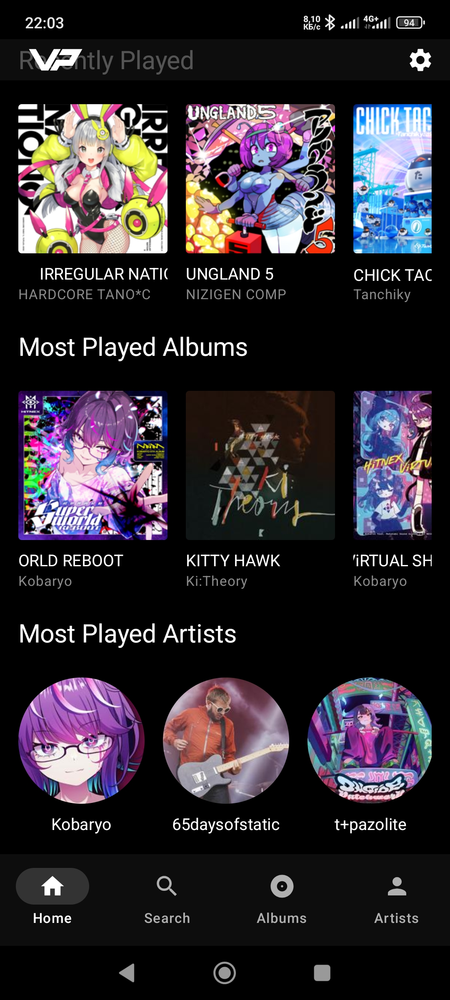
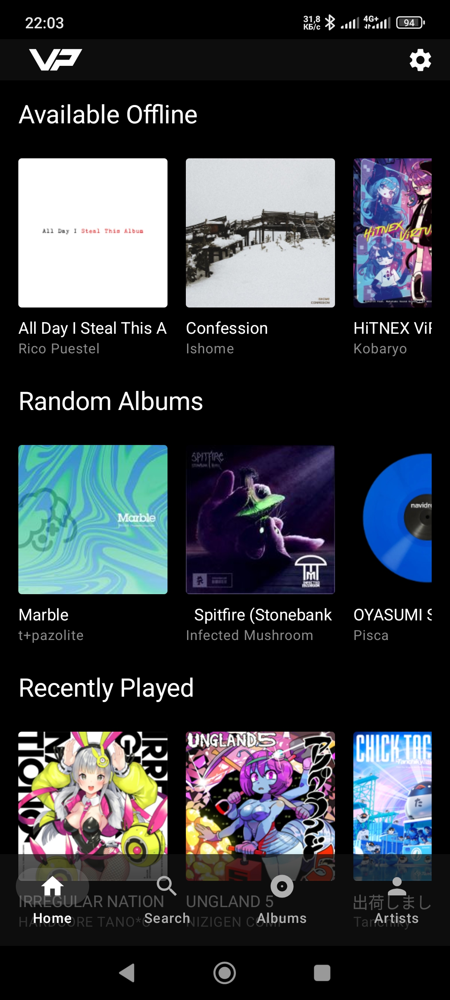
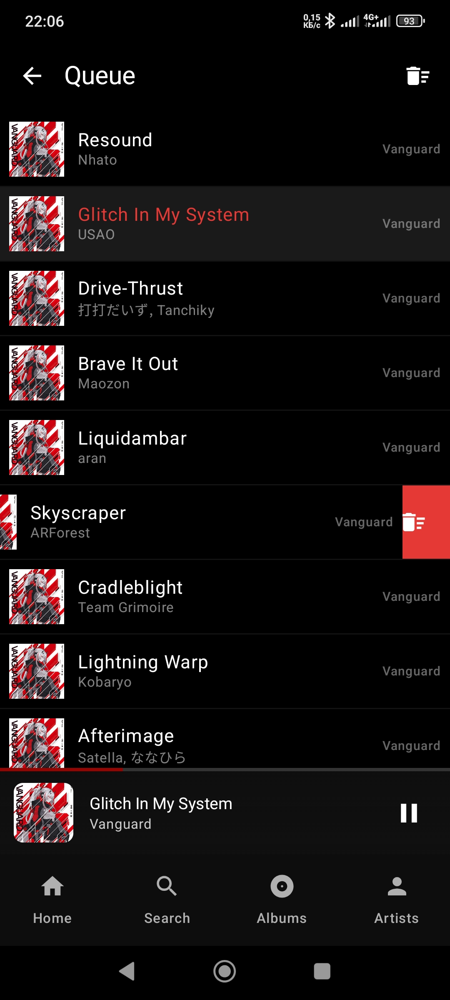
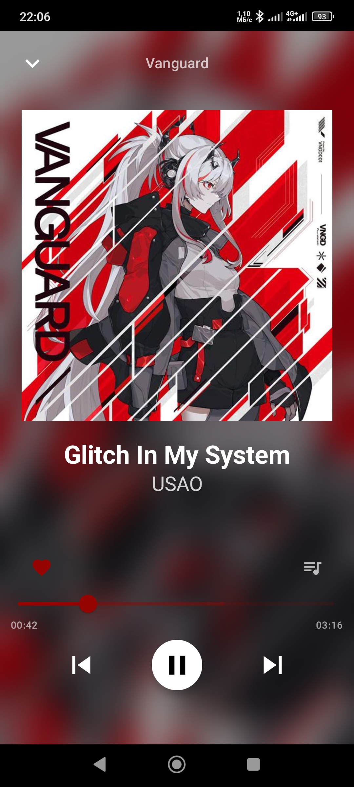
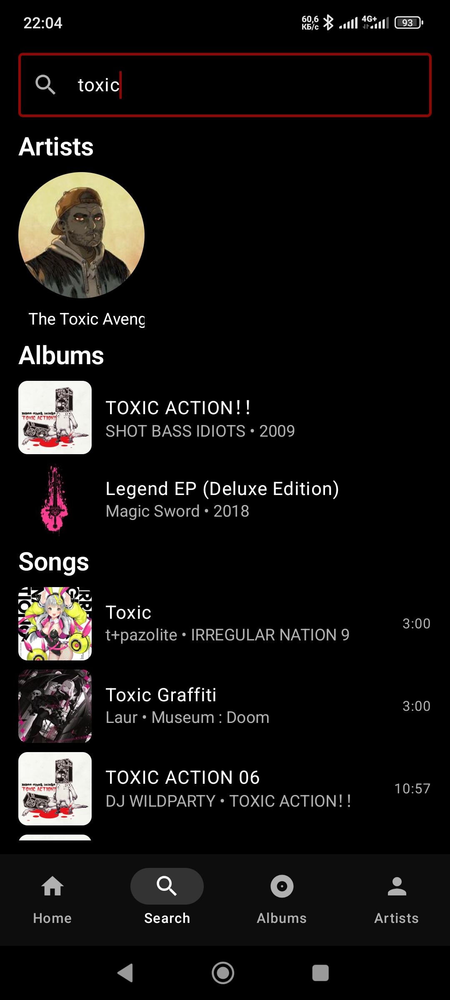
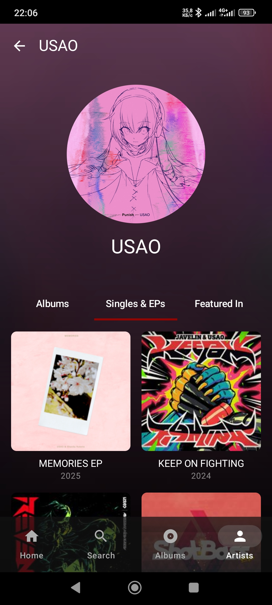
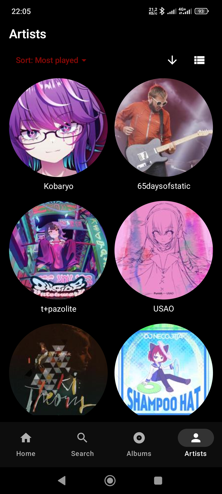
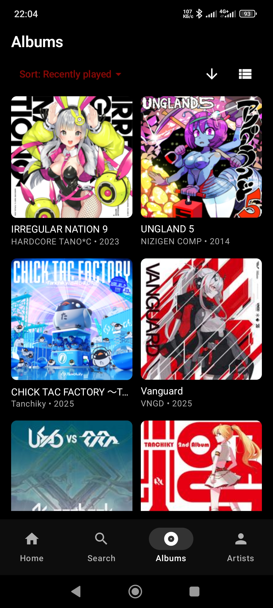

  

# VP [VVAD Player]

**Navidrome music client for Android.** Focused on convenience and speed.

VP is a native Android client for [Navidrome](https://www.navidrome.org/) music servers, built with Jetpack Compose and Media3/ExoPlayer. Designed for fast, offline-first listening with a clean Material 3 interface.

---

## Features

- **Navidrome Integration** — Browse and stream your entire music library
- **Offline-First** — Cache albums for playback without network
- **Background Playback** — Full Media3/ExoPlayer support with notification controls
- **Queue Management** — Hold track to append, clicking track queues whole album

---

## Playback & Queue Controls

### Player Screen
- **Play/Pause, Next/Previous** - Standard transport controls
- **Seek Bar** - Scrub through tracks with haptic feedback
- **Queue Button** - Opens full queue management
- **Song name** - Opens album
- **Artist name** - Opens artist

### Album Screen
- **Download button/checkmark** - Click to download into offline library. Hold to recache or remove.
- **Track entry** - Click to replace queue with album and play from that track. Hold to append track into current queue.

### Queue Screen
- **Now Playing** — Highlighted
- **Swipe to Remove** — Dismiss individual tracks
- **Clear Queue** — One-tap reset

---

## Screenshots

| Album | Home | Home |
|:------:|:------:|:---------:|
|  |  |  |

| Queue | Player | Search |
|:-------:|:-----:|:------:|
|  |  |   |

| Artist | Artists | Albums |
|:-----:|:------:|:--------:|
|  |  |  |

---

## License

MIT License — see [LICENSE](LICENSE) for details.
